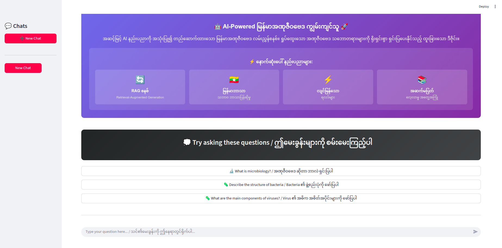

# Burmese Microbiology QA RAG Assistant

An AI-powered Burmese-language question-answering system using Retrieval-Augmented Generation (RAG) and OpenAI GPT models. This project integrates a vector database for domain-specific Q&A retrieval, LangSmith for tracing model calls, and a Streamlit-based UI for interactive usage.



---

## Features

- ✅ **Burmese-Language Support**: Answers questions in Burmese, even if the question is in English.  
- ✅ **Follow-Up Handling**: Maintains conversation context for follow-up questions.  
- ✅ **RAG System**: Retrieves relevant Q&A from a CSV-based knowledge base using vector embeddings.  
- ✅ **Streamlit UI**: Interactive web interface for asking questions and viewing AI responses.  
- ✅ **Traceability with LangSmith**: Uses `@traceable` decorators to log and monitor document retrieval, response generation, and OpenAI API calls.  
- ✅ **Experiment Notebooks**: Jupyter notebooks for testing new queries, prompts, and RAG configurations.

---

## Project Structure

```text
microbiology-burmese-rag/
│
├─ data/
│   └─ microbiology.csv       # CSV dataset with 'Instruction' (question) and 'Output' (answer) columns
│
├─ notebooks/
│   └─ example_experiments.ipynb  # Jupyter notebooks for experimentation, testing vector DB & LLM
│
├─ utils.py                  # Vector DB retriever (SKLearnVectorStore)
├─ rag_pipeline.py           # RAG pipeline: document retrieval, OpenAI calls, LangSmith tracing
├─ app.py                    # Streamlit UI for interactive chat
├─ .env                      # Environment variables (e.g., OPENAI_API_KEY)
└─ README.md                 # Project overview and instructions
```


---

## Installation

### 1. **Clone the repository:**

```bash
git clone https://github.com/zwe-htet-paing/microbiology-burmese-rag.git
cd microbiology-burmese-rag
```

### 2. **Install dependencies using Poetry:**
```bash
poetry install
```

### 3. **Set up environment variables:**

Create a .env file in the project root with your OpenAI API key:
```bash
OPENAI_API_KEY = "your_openai_api_key_here"
LANGSMITH_API_KEY = "your_langsmith_api_key_here"
LANGSMITH_TRACING = "true"
LANGSMITH_PROJECT = "microbiology-assistance-burmese"
```

##  Usage
### 1. **Run the RAG Backend**
```bash
python rag_pipeline.py
```

This initializes the vector store from `microbiology.csv` and allows you to call `langsmith_rag(question)` in Python.

LangSmith traces all important steps: document retrieval, response generation, and OpenAI calls.

### 2. **Run the Streamlit UI**
```bash
streamlit run app.py
```

Open your browser at http://localhost:8501 to interact with the AI assistant.

The UI supports:

- Suggested questions in Burmese and English
- Real-time question submission
- Context-aware follow-up responses
- Tracing via LangSmith for debugging and monitoring


### 3. **Experiment Notebooks**

Explore the `notebooks/` folder for Jupyter notebooks where you can:

- Test new prompts
- Experiment with different queries and retrieved documents
- Evaluate RAG performance on sample datasets


## CSV Format

The knowledge base CSV (`microbiology.csv`) must include:

| Instruction                 | Output                          |
| --------------------------- | ------------------------------- |
| အဏုဇီဝဗေဒ ဆိုတာ ဘာလဲ ရှင်းပြပါ | အဏုဇီဝဗေဒ Microbiology သည် ... |
| Bacteria ၏ ဖွဲ့စည်းပုံကို ဖော်ပြပါ  | Bacteria သည် ...               |


Each row is preserved as a single QA chunk to maintain context integrity.


## How It Works

**1. Vector Store:**  
Uses `SKLearnVectorStore` with `OpenAIEmbeddings` to index all Q&A pairs from the CSV.

**2. Document Retrieval:**  
`retrieve_documents(question)` fetches the most relevant QA chunks based on semantic similarity.

**3. Response Generation:**  
`generate_response(question, documents)` sends the retrieved context to GPT (`gpt-4o-mini`) along with a Burmese-specific system prompt to generate concise and accurate answers.

**4. Follow-Up Handling:**  
Maintains conversation history to link follow-up questions to previous context.

**5. LangSmith Tracing:**  
All key operations (`retrieve_documents`, `generate_response`, `call_openai`) are decorated with `@traceable` to provide observability and debugging capabilities.


## Notes

- Each QA is preserved as a single chunk to avoid splitting context and token-limit errors.
- The system prioritizes accuracy and contextual relevance over verbosity.
- The Streamlit UI uses buttons for suggested questions and displays model answers in real-time.

